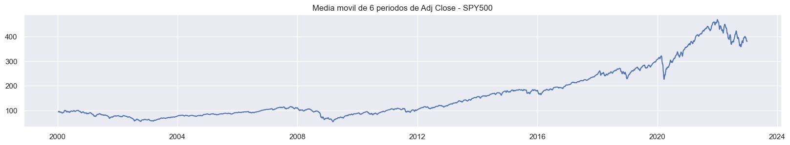
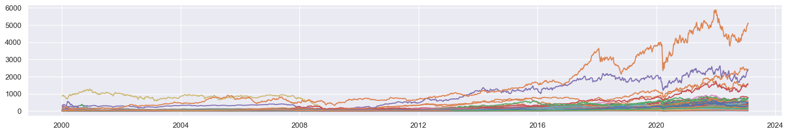

### ✨ ✨ Bienvenidos a mi proyecto de Data Analytics ✨ ✨

  Autora: Natalia Gomez 

El proyecto trató de analizar la base de datos provista por Yahoo Finance.
La base de datos contiene 6 columnas por empresa: Open, Close, High, Low,  Adj Close y Volume. Estas describen el valor de las empresas durante el periodo de tiempo seleccionado, en este caso desde el año 2000 hasta el 2023.  

Dataset [aquí](https://pypi.org/project/yfinance/).

-Carpeta del proyecto:

-PROJECT_ANALYTICS
- images
- EDA.ipynb
- Dashboard.pbix
- SelectedCompanies.csv
- dffiltrado.csv
 
-Pasos que realicé:
1. Descarga de la información usando pandas a variables en mi notebook EDA.ipynb.
2. Análisis exploratorio de los datos en mi notebook, ya sea análisis univariado o correlaciones.
3. Guardado del archivo SelectedCompanies.csv y dffiltrado.csv. 
4. Creación del dashboard en POWER BI.
5. Creación de columna Index en cada tabla.
6. Creación de Measures en cada tabla. 
7. Creación de KPIS.
8. Creación de gráficos.

 Comentarios: Este dataset agrupa la información de las 503 empresas como si fuese una sola. Empleé la media móvil pues es una media confiable para ver las tendencias alcistas o bajistas de las empresas en el tiempo.  

 

  Vemos que efectivamente hubo una tendencia bajista hacia el año 2003, luego el 2009, y luego a inicios de 2020, coincidiendo con el covid.

Hacia el año 2003, la caída de las empresas pudo haber sido ocasionada por la guerra con Irak. Existía la posibilidad de perder contra Irak, a pesar del optimismo inicial ([Fuente](https://elpais.com/economia/2003/03/24/actualidad/1048494775_850215.html)) 

En el año 2008, hubo una crisis en Estados Unidos. Hubo un colapso de la burbuja inmobiliaria, el cual primero impactó a Estados Unidos y luego a nivel global. La situación venía gestandose desde 2006 y la recuperación fue gradual hasta el 2020, cuando sucedió lo del COVID 19.

 

También vemos que los precios se incrementaron en el tiempo, existiendo una pequeña caída desde el 2022. En general las principales bolsas del mundo han experimentado esta caída. (https://www.eleconomista.com.mx/mercados/Caidas-en-las-bolsas-de-valores-en-2022-ano-de-resultados-negativos-20230104-0044.html) 
 

>Por qué existe la tendencia alcista en las empresas?

En general, cuando existe la tendencia alcista se dice que el mercado anda bien. 
Existen muchos factores, uno de ellos es que existe mayor demanda de parte de los inversionistas. Muchos compran, pocos venden. 
Cuando se dan las tendencias bajistas, generalmente se da por una situación desfavorable en aquella empresa en particular, o una crisis a nivel de país o el mundo. 
Otro factor es la devaluación del dólar.

Descripción de las 503 empresas que conforman el SPY500 al 27/02/2023:

| Sector                 | Quantity |
|------------------------|----------|
| Information Technology | 76       |
| Industrials            | 70       |
| Financials             | 67       |
| Health Care            | 64       |
| Consumer Discretionary | 56       |
| Consumer Staples       | 33       |
| Utilities              | 30       |
| Real Estate            | 30       |
| Materials              | 29       |
| Communication Services | 25       |
| Energy                 | 23       |

Esta lista no es inamovible, las empresas deben cumplir ciertos requisitos para estar en la lista. 

 Gráfico de las medias móviles de las 503 empresas. 

 

Vemos que existen ciertas empresas que incrementan significativamente el valor promedio.

### KPIS : Creación de KPIS.

Realicé una investigación sobre cuáles podrían ser mis KPIS.
- Finalmente fueron: 
- Dataset SPY500:
  - Crecimiento bruto anual.
  - Crecimiento bruto por mes.
  - RSI por año,trimestre y mes. 
  
- Dataset de las empresas:
  - RSI por año, trimestre y mes.
  - RSI por día 
  - RSI por día de la semana.

El crecimiento bruto surge de la división entre la suma de los valores dividida entre la suma del periodo anterior, en este caso, año o mes. Puede ser positivo o negativo.

El índice de fuerza relativa (RSI) es un indicador de impulso técnico. Mide la velocidad y la magnitud de los cambios recientes en el precio de un activo. Esto ayuda a los comerciantes a identificar activos que están potencialmente sobrecomprados, lo que significa que están negociando por encima de su valor real, o sobrevendidos, lo que significa que están negociando por debajo de su valor real. RSI fue desarrollado por el analista James Welles Wilder Jr. e introducido en su libro de 1978, "Nuevos conceptos en sistemas técnicos de comercio". Welles Wilder Jr. lo llamó Índice de Fuerza Relativa porque compara la fuerza de un activo en sus días de alza con la fortaleza del mismo activo en sus días de baja. Welles Wilder Jr. sugirió recopilar datos de los últimos 14 períodos comerciales (días).([Fuente](https://finance.yahoo.com/news/rsi-221338860.html))

El RSI es un indicador muy usado para saber cúando comprar o vender las acciones de una empresa. Oscila desde 0 a 100. Cuando es alrededor de 30, se recomienda comprar, y cuando es cercano a 100, vender. 

Overview del RSI del spy500:

Luego de realizar una serie de filtros, decidí analizar a las empresas:
1. AZO
2. CTAS
3. ORLY
4. CMG
5. GWW

-AZO

AutoZone, Inc. es un minorista estadounidense de repuestos y accesorios automotrices del mercado secundario, el más grande de los Estados Unidos. Fundada en 1979, AutoZone tiene 6978 tiendas en los Estados Unidos, México, Puerto Rico, Brasil y las Islas Vírgenes de los Estados Unidos.

-CTAS

Cintas Corporation es una corporación estadounidense con sede en Mason, Ohio, que ofrece una gama de productos y servicios a empresas, incluidos uniformes, tapetes, trapeadores, suministros de limpieza y baños, productos de primeros auxilios y seguridad, extintores de incendios y pruebas, y cursos de seguridad.

-ORLY

O'Reilly Automotive, Inc. es un minorista estadounidense de repuestos para automóviles que ofrece repuestos, herramientas, suministros, equipos y accesorios para automóviles a proveedores de servicios profesionales y clientes de bricolaje. Fundada en 1957 por la familia O'Reilly, la empresa opera más de 5600 tiendas en 47 estados y México.

- CMG

Chipotle Mexican Grill es una franquicia de restaurantes de comida rápida especializada en cocina tex-mex. Su sede se encuentra en Los Ángeles (Estados Unidos) y cuenta con más de 2000 establecimientos en cinco países.

-GWW

W. W. Grainger, Inc. es una empresa de suministro industrial estadounidense fundada en 1927 en Chicago por William W. (Bill) Grainger. Fundó la empresa para brindar a los consumidores acceso a un suministro constante de motores. La compañía ahora atiende a más de tres millones de clientes en todo el mundo con ofertas como motores, iluminación, manejo de materiales, sujetadores, plomería, herramientas y suministros de seguridad, junto con servicios de administración de inventario y soporte técnico.

Cada empresa, sea una de estas u otras, tiene su propio día de la semana y día del mes más favorable para invertir.
AZO Y CMG son las empresas más caras. ORLY Y GWW son intermedias y CTAS la más económica. 

Overview del dashboard, página principal:

Cada una de las empresas tiene su página de análisis, en la que se ven sus tendencias y cómo van variando en el tiempo.

  Conclusiones: 

- En general, existe una tendencia alcista.
- Las tendencias bajistas fueron ocasionadas por crisis a nivel de país o a nivel mundial, las cuales afectaron las compras de los inversionistas, quienes no querían arriesgar.
- Ciertas empresas con valores altos incrementan el valor promedio general.
- La decisión de en cúal o cúales empresas invertir dependerá del capital disponible, del sector preferido y de cúanto riesgo estás dispuesto a asumir. 

